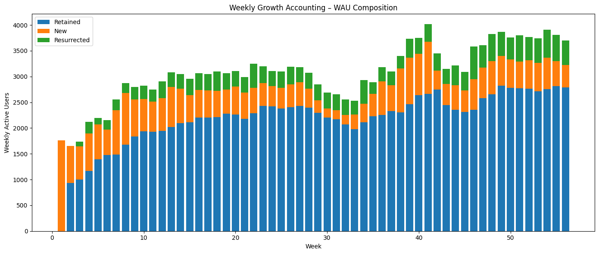
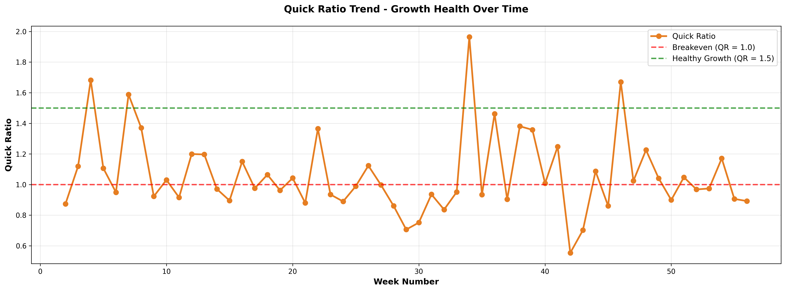

# HealthKart Growth & Retention Analysis  
### Weekly Growth Accounting & Quick Ratio Diagnostics

## Overview
This repository contains a **product growth and retention case study** that analyzes weekly user behavior using **Growth Accounting** and **Quick Ratio** metrics.

The goal of this analysis is to go beyond vanity metrics like WAU growth and evaluate whether growth is **sustainable, efficient, and retention-driven**, or if it is masking underlying churn.

The analysis was performed using **Python and Jupyter Notebook**, with insights translated into business and product recommendations.

---

## Problem Statement
HealthKart-style growth data shows an increase in weekly active users. However, top-line growth alone does not answer:

- Are users being retained?
- Is growth driven by product stickiness or repeated acquisition?
- Is churn silently offsetting new user gains?

This project answers:
> **Is the product growing because users find value, or because acquisition keeps filling a leaky bucket?**

---

## Methodology

### 1. Growth Accounting
Weekly Active Users are broken down into:
- New Users
- Retained Users
- Resurrected Users
- Churned Users  

This decomposition helps identify the **true drivers of growth**.

### 2. Quick Ratio
Quick Ratio measures **growth efficiency**:

- Quick Ratio > 1 → Healthy, compounding growth  
- Quick Ratio < 1 → Churn outweighs growth  

Tracking this weekly highlights unstable or expensive growth patterns.

---

## Key Visual Insights

### Weekly Growth Accounting
This chart shows the composition of WAU across weeks, highlighting dependency on acquisition versus retention.

---

### Quick Ratio Trend
This chart tracks growth efficiency over time and flags weeks where churn exceeded user gains.

---

## Business Insights (Summary)
- Growth is **volatile**, not compounding
- Several high-acquisition weeks are followed by sharp churn spikes
- Retention, not acquisition, is the primary growth bottleneck
- Resurrection trends suggest latent brand trust and win-back potential

---

## Technical Implementation
- Performed exploratory data analysis using **Python (Pandas)**  
- Built reproducible workflows in **Jupyter Notebook**
- Computed weekly growth metrics programmatically
- Visualized trends using **Matplotlib**
- Validated results using spreadsheet-based calculations
- Structured outputs for clarity and stakeholder readability

---

## Tools & Concepts
- Growth Accounting Framework
- Quick Ratio Analysis
- Python (Pandas, Matplotlib)
- Jupyter Notebook
- Excel / Spreadsheet modeling
- Product and business metrics interpretation

---

## Outcome
This case study demonstrates how **data-driven product analytics** can uncover hidden retention issues and prevent misleading growth narratives. The approach reflects real-world expectations for **Product Analyst, Growth, and Consulting roles**.

---

## Disclaimer
This project is for educational and demonstration purposes only.  
No confidential or proprietary HealthKart data has been used.
